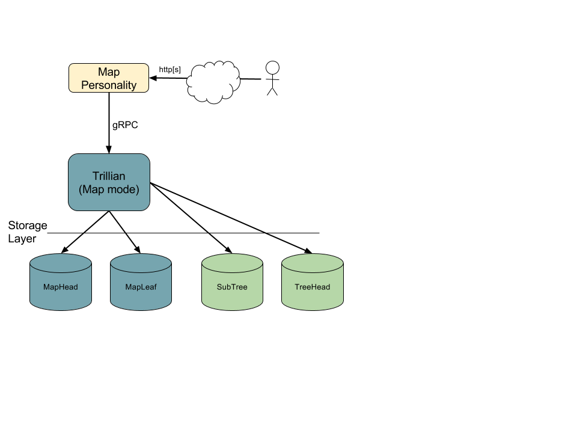
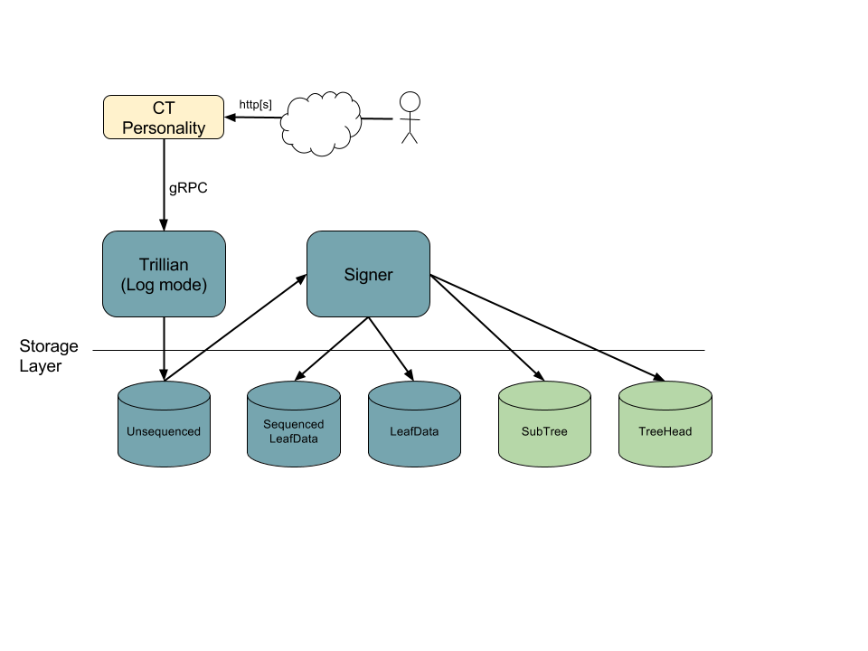

Trillian: General Transparency
==============================

[](https://travis-ci.org/google/trillian)
[](https://goreportcard.com/report/github.com/google/trillian)
[](https://godoc.org/github.com/google/trillian)

 - [Overview](#overview)
 - [Using the Code](#using-the-code)
     - [MySQL Setup](#mysql-setup)
     - [Integration Tests](#integration-tests)
 - [Working on the Code](#working-on-the-code)
     - [Rebuilding Generated Code](#rebuilding-generated-code)
     - [Updating Vendor Code](#updating-vendor-code)
     - [Running Codebase Checks](#running-codebase-checks)
 - [Design](#design)
     - [Design Overview](#design-overview)
     - [Map Mode](#map-mode)
     - [Log Mode](#log-mode)
     - [Personalities](#personalities)
 - [Use Cases](#use-cases)
     - [Certificate Transparency Log](#certificate-transparency-log)
     - [Verifiable Log-Derived Map](#verifiable-log-derived-map)


Overview
--------

Trillian is an implementation of the concepts described in the
[Verifiable Data Structures](docs/VerifiableDataStructures.pdf) white paper,
which in turn is an extension and generalisation of the ideas which underpin
[Certificate Transparency](https://certificate-transparency.org).

Trillian implements a [Merkle tree](https://en.wikipedia.org/wiki/Merkle_tree)
whose contents are served from a data storage layer, to allow scalability to
extremely large trees.  On top of this Merkle tree, Trillian provides two
modes:

 - An append-only **Log** mode, analogous to the original
   [Certificate Transparency](https://certificate-transparency.org) logs.  In
   this mode, the Merkle tree is effectively filled up from the left, giving a
   *dense* Merkle tree.
 - A **Map** mode that allows transparent storage of arbitrary key:value pairs.
   In this mode, the key's hash is used to designate a particular leaf of a deep
   Merkle tree, giving a *sparse* Merkle tree.  (A Trillian Map is an *unordered*
   map; it does not allow enumeration of the Map's keys.)

Note that Trillian requires particular applications to provide their own
[personalities](#personalities) on top of the core transparent data store
functionality; example code for a certificate transparency log and for a
[log-derived map](#verifiable-log-derived-map) are included to help with this.


Using the Code
--------------

**WARNING**: The Trillian codebase is still under development, and is not yet
suitable for production use.  Everything here is subject to change without
notice &ndash; including APIs, database schemas, and code layout.

To build and test Trillian you need:

 - Go 1.9 or later.

To run integration tests (and production deployment) you need:

 - [MySQL](https://www.mysql.com/) or [MariaDB](https://mariadb.org/) to provide
   the data storage layer; see the [MySQL Setup](#mysql-setup) section.

Use the standard Go tools to install other dependencies.

```bash
go get github.com/google/trillian
cd $GOPATH/src/github.com/google/trillian
go get -t -u -v ./...
```

To build and run tests, use:

```bash
go test ./...
```

The repository also includes multi-process integration tests, described in the
[Integration Tests](#integration-tests) section below.

### MySQL Setup

To run Trillian's integration tests you need to have an instance of MySQL
running and configured to:

 - listen on the standard MySQL port 3306 (so `mysql --host=127.0.0.1
   --port=3306` connects OK)
 - not require a password for the `root` user

You can then set up the [expected tables](storage/mysql/storage.sql) in a `test`
database like so:

```bash
./scripts/resetdb.sh
Warning: about to destroy and reset database 'test'
Are you sure? y
> Resetting DB...
> Reset Complete
```

### Integration Tests

Trillian includes an integration test suite to confirm basic end-to-end
functionality, which can be run with:

```bash
./integration/integration_test.sh
```

This runs several multi-process tests:

 - A [test](integration/map_integration_test.go) that starts a Trillian server
   in Map mode, sets various key:value pairs and checks they can be retrieved.
 - A [test](integration/log_integration_test.go) that starts a Trillian server
   in Log mode, together with a signer, logs many leaves, and checks they are
   integrated correctly.
 - A [test](integration/ct_integration_test.go) that starts a set of Trillian
   servers in Log mode, plus a signer and a set of Certificate Transparency
   personality servers, then runs tests that exercise all of the
   [RFC6962 entrypoints](https://tools.ietf.org/html/rfc6962#section-4).


Working on the Code
-------------------

Developers who want to make changes to the Trillian codebase need some
additional dependencies and tools, described in the following sections.  The
[Travis configuration](.travis.yml) for the codebase is also useful reference
for the required tools and scripts, as it may be more up-to-date than this
document.

### Rebuilding Generated Code

Some of the Trillian Go code is autogenerated from other files:

 - [gRPC](http://www.grpc.io/) message structures are originally provided as
   [protocol buffer](https://developers.google.com/protocol-buffers/) message
   definitions.
 - Some unit tests use mock implementations of interfaces; these are created
   from the real implementations by [GoMock](https://github.com/golang/mock).
 - Some enums have string-conversion methods (satisfying the `fmt.Stringer`
   interface) created using the
   [stringer](https://godoc.org/golang.org/x/tools/cmd/stringer) tool (`go get
   golang.org/x/tools/cmd/stringer`).

Re-generating mock or protobuffer files is only needed if you're changing
the original files; if you do, you'll need to install the prerequisites:

  - `mockgen` tool from https://github.com/golang/mock
  - `protoc`, [Go support for protoc](https://github.com/golang/protobuf) and
     [grpc-gateway](https://github.com/grpc-ecosystem/grpc-gateway) (see
     documentation linked from the
     [protobuf site](https://github.com/google/protobuf))
  - protocol buffer definitions for standard Google APIs:

    ```bash
    git clone https://github.com/googleapis/googleapis.git $GOPATH/src/github.com/googleapis/googleapis
    ```

and run the following:

```bash
go generate -x ./...  # hunts for //go:generate comments and runs them
```

### Updating Vendor Code

The Trillian codebase includes a couple of external projects under the `vendor/`
subdirectory, to ensure that builds use a fixed version (typically because the
upstream repository does not guarantee back-compatibility between the tip
`master` branch and the current stable release).  These external codebases are
included as Git
[subtrees](https://github.com/git/git/blob/master/contrib/subtree/git-subtree.txt).

To update the code in one of these subtrees, perform steps like:

```bash
# Add master repo for upstream code as a Git remote.
git remote add vendor-xyzzy https://github.com/orgname/xyzzy
# Pull the updated code for the desired version tag from the remote, dropping history.
# Trailing / in prefix is needed.
git subtree pull --squash --prefix=vendor/github.com/orgname/xyzzy/ vendor-xyzzy vX.Y.Z
```

If new `vendor/` subtree is required, perform steps similar to:

```bash
# Add master repo for upstream code as a Git remote.
git remote add vendor-xyzzy https://github.com/orgname/xyzzy
# Pull the desired version of the code in, dropping history.
# Trailing / in --prefix is needed.
git subtree add --squash --prefix=vendor/github.com/orgname/xyzzy/ vendor-xyzzy vX.Y.Z
```

### Running Codebase Checks

The [`scripts/presubmit.sh`](scripts/presubmit.sh) script runs various tools
and tests over the codebase.

```bash
# Install gometalinter and all linters
go get -u github.com/alecthomas/gometalinter
gometalinter --install

# Run code generation, build, test and linters
./scripts/presubmit.sh

# Or just run the linters alone:
gometalinter --config=gometalinter.json ./...
```

Design
------

### Design Overview

Trillian is primarily implemented as a
[gRPC service](http://www.grpc.io/docs/guides/concepts.html#service-definition);
this service receives get/set requests over gRPC and retrieves the corresponding
Merkle tree data from a separate storage layer (currently using MySQL), ensuring
that the cryptographic properties of the tree are preserved along the way.

The Trillian service is multi-tenanted &ndash; a single Trillian installation
can support multiple Merkle trees in parallel, distinguished by their `TreeId`
&ndash; and operates in one of two modes:

 - **Log** mode: an append-only collection of items.
 - **Map** mode: a collection of key:value pairs.

In either case, Trillian's key transparency property is that cryptographic
proofs of inclusion/consistency are available for data items added to the
service.

### Personalities

The Trillian service expects to be paired with additional code that is specific
to the particular application of the transparent store; this is known as a
*personality*.

The primary purpose of a personality is to implement **admission criteria** for
the store, so that only particular types of data are added to the store. For
example, a certificate transparency log only accepts data items that are valid
certificates; a "CT Log" personality would police this, so that the Trillian
service can process all incoming data blindly.

A personality may also perform **canonicalization** on incoming data, to
convert equivalent formulations of the same underlying data to a single
canonical format, avoiding needless duplication.  (For example, keys in
JSON dictionaries could be sorted, or Unicode string data could be normalised.)

The per-application personality is also responsible for providing an
externally-visible interface, typically over HTTP[S].

Note that a personality may need to implement its own data store,
separate from Trillian.  In particular, if the personality does not
completely trust Trillian, it needs to store the various things that
Trillian signs in order to be able to detect problems (and so the
personality effectively also acts as a monitor for Trillian).

### Map Mode

Trillian in Map mode can be thought of as providing a key:value store, together
with cryptographic transparency guarantees for that data.

When running in Map mode, Trillian provides a straightforward gRPC API with the
following available operations:

 - `GetSignedMapRoot` returns information about the current root of the Merkle
   tree representing the Map, including a revision (see below), hash value,
   timestamp and signature.
 - `GetLeaves` returns leaf information for a specified set of key values,
   optionally as of a particular revision.  The returned leaf information also
   includes inclusion proof data.
 - `SetLeaves` requests inclusion of specified key:value pairs into the Map;
   these will appear as the next revision of the Map.

(Documentation may be out-of-date; please check the protocol buffer
[message definitions](trillian_map_api.proto) for the definitive current map API.)

Each `SetLeaves` request includes a batch of updates to the Map; once all of
these updates have been applied, the Map has a new **revision**, with a new tree
head for that revision.  To allow historical queries, the API allows queries
of the Map as of a particular revision.

TODO: add description of per-personality Mappers

TODO: add description of distribution: how many instances run, how distributed,
how synchronized (master election), mention use of transactions as a fallback
(in case of errors in master election).



### Log Mode

When running in Log mode, Trillian provides a gRPC API whose operations are
similar to those available for Certificate Transparency logs
(cf. [RFC 6962](https://tools.ietf.org/html/6962)). These include:

 - `GetLatestSignedLogRoot` returns information about the current root of the
   Merkle tree for the log, including the tree size, hash value, timestamp and
   signature.
 - `GetLeavesByHash` and `GetLeavesByIndex` return leaf information for
   particular leaves, specified either by their hash value or index in the log.
 - `QueueLeaves` requests inclusion of specified items into the log.
 - `GetInclusionProof`, `GetInclusionProofByHash` and `GetConsistencyProof`
    return inclusion and consistency proof data.

In Log mode, Trillian includes an additional Signer component; this component
periodically processes pending queued items and adds them to the Merkle tree,
creating a new signed tree head as a result.




TODO: add description of distribution: how many instances run, how distributed etc.

### Logged Map

As it currently stands, it is not possible to reliably monitor or audit a
Trillian Map instance; key:value pairs can be modified and subsequently reset
without anyone noticing.

A future plan to deal with this is to create a *Logged Map*, which combines a
Trillian Map with a Trillian Log so that all published revisions of the Map
have their signed tree head data appended to the corresponding Map.


Use Cases
---------

### Certificate Transparency Log

The most obvious application for Trillian in Log mode is to provide a
certificate transparency (RFC 6962) Log.  To do this, the CT Log personality
needs to include all of the certificate-specific processing &ndash; in
particular, checking that an item that has been suggested for inclusion is
indeed a valid certificate that chains to an accepted root.

### Verifiable Log-Derived Map

One useful application for Trillian in Map mode is to provide a verifiable
log-derived map (VLDM), as described in the
[Verifiable Data Structures](docs/VerifiableDataStructures.pdf) white paper
(which uses the term 'log-backed map').  To do this, a VLDM personality would
monitor the additions of entries to a Log, potentially external, and would write
some kind of corresponding key:value data to a Trillian Map.

Clients of the VLDM are then able to verify that the entries in the Map they are
shown are also seen by anyone auditing the Log for correct operation, which in
turn allows the client to trust the key/value pairs returned by the Map.

A concrete example of this might be a VLDM that monitors a certificate
transparency Log and builds a corresponding Map from domain names to the set of
certificates associated with that domain.

The following table summarizes properties of data structures laid in the
[Verifiable Data Structures](docs/VerifiableDataStructures.pdf) white paper.
“Efficiently” means that a client can and should perform this validation
themselves.  “Full audit” means that to validate correctly, a client would need
to download the entire dataset, and is something that in practice we expect a
small number of dedicated auditors to perform, rather than being done by each
client.


|                                          |  Verifiable Log        |  Verifiable Map        |  Verifiable Log-Derived Map |
| ---------------------------------------- | ---------------------- | ---------------------- |---------------------------- |
| Prove inclusion of value                 |  Yes, efficiently      |  Yes, efficiently      |  Yes, efficiently           |
| Prove non-inclusion of value             |  Impractical           |  Yes, efficiently      |  Yes, efficiently           |
| Retrieve provable value for key          |  Impractical           |  Yes, efficiently      |  Yes, efficiently           |
| Retrieve provable current value for key  |  Impractical           |  No                    |  Yes, efficiently           |
| Prove append-only                        |  Yes, efficiently      |  No                    |  Yes, efficiently [1].      |
| Enumerate all entries                    |  Yes, by full audit    |  Yes, by full audit    |  Yes, by full audit         |
| Prove correct operation                  |  Yes, efficiently      |  No                    |  Yes, by full audit         |
| Enable detection of split-view           |  Yes, efficiently      |  Yes, efficiently      |  Yes, efficiently           |

- [1] -- although full audit is required to verify complete correct operation
