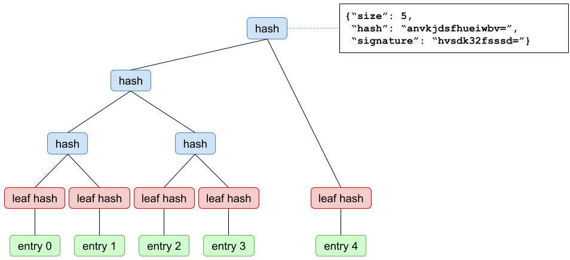

# Verifiable Data Structures

The Google TrustFabric team

*Last updated in May 2021*

### Introduction 

Much of life relies on trust in various authorities. In the internet realm, site­ owners trust Certificate Authorities to issue certificates, mail clients may trust a key server to return the right public key for a recipient they wish to mail to, server administrators trust their package distributors to send them binaries for their software. In the real world, citizens trust land registries to accurately record who owns which land.  

This paper describes a number of data structures and their applications that allow adding transparency to the trust model, allowing an ecosystem to evolve from pure trust, to trust but verify. By adding transparency to services, trust can be verified by the ecosystems that depend upon them.

### Verifiable Logs 

The first structure we describe is an append­-only log. It begins empty and is mutated only by entries being appended to it. Once an entry has been accepted by the log, it can never be removed or changed. Periodically the log publishes a *checkpoint* that includes a commitment to all entries for a given log size. Clients of the log can: 
1. Enumerate all entries held in the log. 
2. Verify that a specific entry is included in the log, given just a checkpoint and an inclusion proof. 
3. Verify the append-­only property of the log, given two checkpoints and a consistency proof. 

Furthermore, the fact that it is possible to efficiently check that a log is append-only makes it efficient to detect *split-­view attacks*, assuming a sufficient *gossip protocol* is in place for the log checkpoints.

One common instantiation of a verifiable log is a Merkle tree, for example as described in [RFC6962](https://tools.ietf.org/html/rfc6962) and implemented in [Trillian](https://github.com/google/trillian).

### Verifiable Maps 

The next structure we describe is a verifiable map. A verifiable map is a map from a set of keys to a corresponding set of values. Periodically the map publishes a signed map checkpoint that includes a commitment to all of its entries.

Clients of the map can: 
1. Enumerate all key/value pairs held in the map. 
2. Retrieve the value (or indication of non­presence) for a key, and verify that this is included (or not present) in the map at a point in time, given a map checkpoint and an inclusion proof.

Unlike for a verifiable log, there is no inherent way to efficiently verify that a map is append-only (see [this article](https://transparency.dev/articles/logs-vs-maps/) for more discussion).  This in turn makes it hard to innately detect split-view attacks on maps that evolve over time, but we discuss below ways to address this.

One common instantiation of a verifiable map is the Sparse Merkle Tree described in [Revocation Transparency](http://sump2.links.org/files/RevocationTransparency.pdf) and implemented in [Trillian](https://github.com/google/trillian/tree/master/experimental/batchmap).

### Verifiable Log-Derived Map (VLDM)

A verifiable log-derived map is a verifiable map created from a verifiable log in a deterministic and verifiable manner. The signed map checkpoint incorporates a log checkpoint, attesting that the map has included entries committed to by that checkpoint.

In this manner a client gets the convenience of verifiable answers provided by a map, and the consistency guarantees provided by the underlying log. Any party willing to download and replay the entire log can verify the correct behavior of the map over time. 

This data structure can be used for arbitrary log entries and derivation functions, as long as these functions are deterministic. Importantly, the verifiable map may in fact be operated by an entirely different party than the backing log.

For example, a third party Certificate Transparency monitor might choose to expose a verifiable map that maps domain names (as keys) to a set of X.509 certificates (as values). Such a monitor may expose a verifiable map based upon a Certificate Transparency log operated by another party.

In order to address the difficulties of efficiently detecting split-view attacks on maps, all signed map checkpoints can be published to a separate verifiable log, called the map checkpoint log (MCL for short), which makes all checkpoints published by the map available. This log ensures that clients can verify that the version of the map they have been shown is globally visible.  As with the map, the MCL may be operated by another party.

1. Entries in the log are used to populate the map.

2. The log periodically publishes checkpoints.

3. The map consumes log entries in order and periodically publishes a new map checkpoint, incorporating a specific log checkpoint.

4. Published map checkpoints are written to a verifiable log.

5. This map checkpoint log also periodically publishes its own checkpoints.

### Summary 

The following table summarizes properties of the data structures laid out above.
“Efficiently” means that a client can and should perform this validation
themselves. “Full audit” means that to validate correctly, a client would need
to download the entire dataset, and is something that in practices we expect a
small number of dedicated auditors to perform, rather than being done by each
client. 

Operation | Log | Map | Log-derived Map 
------------- | :-----------------: | :-----------------: | :----------------------------------:
Prove inclusion of value | Yes, efficiently | Yes, efficiently | Yes, efficiently 
Prove non-inclusion of value | Impractical | Yes, efficiently | Yes, efficiently 
Retrieve provable value for key | Impractical | Yes, efficiently | Yes, efficiently 
Retrieve provable current value for key | Impractical | No | Yes, efficiently 
Prove append-only | Yes, efficiently | No | Yes, efficiently, although full audit is required to verify complete correct operation. 
Enumerate all entries | Yes, by full audit | Yes, by full audit | Yes, by full audit 
Prove correct operation | Yes, efficiently | No | Yes, by full audit 
Enable detection of split-views | Yes, efficiently | No | Yes, efficiently

