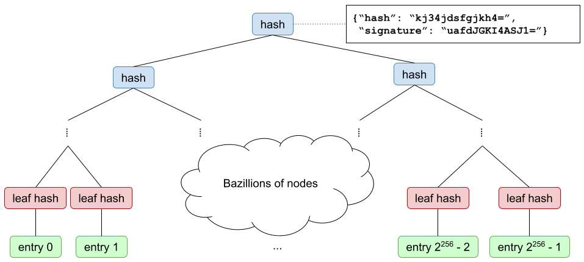

# Verifiable Data Structures

Adam Eijdenberg (eijdenberg@google.com)  
Ben Laurie (benl@google.com)  
Al Cutter (al@google.com)  

*November 2015*

### Introduction 

Much of life relies on trust in various authorities. In the internet realm,
site­ owners trust Certificate Authorities to issue certificates, mail clients
may trust a key server to return the right public key for a recipient they wish
to mail to, server administrators trust their package distributors to send them
binaries for their software. In the real world, citizens trust land registries
to accurately record who owns which land.  

This paper describes a number of data
structures and their applications that allow adding transparency to the trust
model, allowing an ecosystem to evolve from pure trust, to trust but verify. By
adding transparency to services, trust can be verified by the ecosystems that
depend upon them.

### Verifiable Logs 

The first structure we describe is an append­-only log. It begins empty and is
mutated only by entries being appended to it. Once an entry has been accepted by
the log, it can never be removed or changed. Periodically the log will publish a
*signed tree head* which includes a root hash of all entries for a given log size.
Clients of the log can: 
1. Efficiently verify that a specific entry is included in the log. 
2. Efficiently detect split-­view attacks. 
3. Efficiently verify the append-­only property of the log. 
4. Enumerate all entries held in the log. 

The verifiable log as described is equivalent to that described in
[RFC6962](https://tools.ietf.org/html/rfc6962).


### Verifiable Maps 

The next structure we describe is a verifiable map. A verifiable map is a map
from a set of keys to a corresponding set of values. Periodically the map will
publish a signed tree head which includes a root hash of all 2<sup>256</sup>
entries.

Clients of the map can: 
1. Efficiently retrieve the value (or indication of non­presence) for a key, and
verify that this is included (or not present) in the map at a point in time. 
2. Efficiently detect split­-view attacks. 
3. Enumerate all key/value pairs held in the map. 

This verifiable map as described is equivalent to the Sparse Merkle Tree
described in [Revocation
Transparency](http://sump2.links.org/files/RevocationTransparency.pdf).



The entry index for a key is calculated by taking the SHA-256 hash of the key,
and treating that as a 256-­bit big endian integer. The value for that key is
stored in the leaf node indexed by this number. The tree size is therefore
always 2<sup>256</sup>.

### Verifiable Log-­Backed Map (VLBM)

A verifiable log­-backed map is a verifiable map backed by a verifiable log that
describes an ordered set of operations that result in predictable mutations to
the map. Periodically the verifiable log-­backed map will publish a signed tree
head which includes a root hash for the map for a given verifiable log size and
signed tree hash. The map, for a given log size, is populated (in a verifiable
manner) by applying the operations contained in the log in order. In addition
all signed tree heads for the map (henceforth, signed map heads or SMHs) are
published to a separate verifiable log such that all root hashes published by
the map are available for audit over time. This log ensures that clients can
verify that the map they have been shown has also been seen by anyone auditing
the log for correct operation, which in turn allows the client to trust the
key/value pairs returned by the map. 

In this manner a client gets the convenience of verifiable answers, and the
consistency guarantees provided by the underlying log. An auditor (or client
willing to download and replay the entire log) can additionally verify the
correct behavior of the database over time.

This data structure does not describe the format of a log entry, nor
specifically how it affects the map. Importantly, the verifiable map may in fact
be operated by an entirely different party than the backing log and in turn the
log that it writes its signed map heads to may in fact be operated by another
party again.

For example, a 3rd party Certificate Transparency monitor might choose to expose
a verifiable map that maps domain names (as keys) to a set of X.509 certificates
(as values). Such a monitor may expose a verifiable map based upon a Certificate
Transparency log operated by another party. The signed tree head for the map
incorporates the signed tree head supplied by the log, attesting that the map
has included entries captured by the log up to that tree size.

1. Entries in log represent mutations in map.


2. Mutation Log periodically publishes Signed Tree Head.

3. Map replays mutation entries in order and periodically publishes new Signed
Map Head, incorporating a specific STH.


4. Published Signed Map Heads are written to a Verifiable Log.

5. Log of Signed Map Heads periodically publishes Signed Tree Heads.


### Summary 

The following table summarizes properties of the data structures laid out above.
“Efficiently” means that a client can and should perform this validation
themselves. “Full audit” means that to validate correctly, a client would need
to download the entire dataset, and is something that in practices we expect a
small number of dedicated auditors to perform, rather than being done by each
client. 

Operation | Verifiable Log | Verifiable Map | Verifiable Log-­Backed Map 
------------- | :-----------------: | :-----------------: | :----------------------------------:
Prove inclusion of value | Yes, efficiently | Yes, efficiently | Yes, efficiently 
Prove non­inclusion of value | Impractical | Yes, efficiently | Yes, efficiently 
Retrieve provable value for key | Impractical | Yes, efficiently | Yes, efficiently 
Retrieve provable current value for key | Impractical | No | Yes, efficiently 
Prove append­-only | Yes, efficiently | No | Yes, efficiently, although full audit is required to verify complete correct operation. 
Enumerate all entries | Yes, by full audit | Yes, by full audit | Yes, by full audit 
Prove correct operation | Yes, efficiently | No | Yes, by full audit 
Enable detection of split­-views | Yes, efficiently | Yes, efficiently | Yes, efficiently

### Example: Verifiable Database

Here is an example Verifiable Database that is composed using a Verifiable Log
and Verifiable Map.  The function `_apply_operation` shows how operations
sequenced by the log are applied to a map:

```
# Example general purpose verifiable database
# Mutation operations append to its log
# Its verifiable map then calls the callback (_apply_operation) to change the view.
class VerifiableDatabase(VerifiableBase):
    def __init__(self):
	VerifiableBase.__init__(self, VerifiableLog())

    # Example database operation, just serializes and appends to log
    def set(self, key, value):
	self._log.append(json.dumps({'operation': 'set', 'key': key, 'value': value}))

    # Example database operation, just serializes and appends to log
    def delete(self, key):
	self._log.append(json.dumps({'operation': 'delete', 'key': key}))

    # Private callback for the underlying map when new entries are sequenced by the log
    def _apply_operation(self, idx, operation, map):
	op = json.loads(operation)
	if op['operation'] == 'set':
	    map.put(str(op['key']), str(op['value']))
	elif op['operation'] == 'delete':
	    map.put(str(op['key']), '')

    # Return a value and proof for a key and given tree_size (as returned by get_tree_head)
    def get(self, key, tree_size):
	val, proof = VerifiableBase.get(self, str(key), tree_size)
	val = str(val) if len(val) else None
	return val, proof
```
