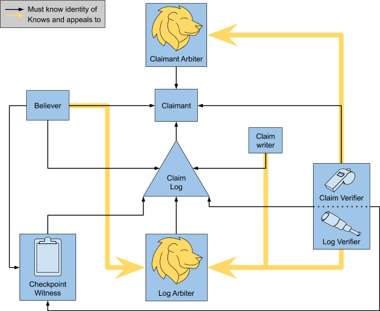

# Claimant Model: Logs

This doc presents a model for transparent ecosystems built around logs. This doc requires understanding the core [Claimant Model](CoreModel.md).

Log Transparency as described here should be applied to situations where the Claimant Model has already been established for the domain claims. It does not cover situations where you “just want to write to a log”.

## Purpose of Log Transparency
**The main purpose of transparency built around logs is *discoverability of Claims***.

A Claim is discoverable if it can be found by the Verifier without information being passed to them by the Believer. This property is essential when Believers are employing Trust But Verify and the identity of all Verifiers does not form part of the Believer’s [TCB](https://en.wikipedia.org/wiki/Trusted_computing_base).

More formally: *Any claim believed by any honest Believer must be eventually verified by an honest Verifier*.

Another way to conceptualize this is that Logs provide a verifiable transport mechanism to ensure that any Claim that a Believer relies on will be eventually discovered by the Verifier.

# Model
Log Transparency is another application of the Claimant Model to solve a transport problem in what we will refer to as SystemDOMAIN; it provides a mechanism for all StatementDOMAIN relied upon by BelieverDOMAIN to be discovered by VerifierDOMAIN.

## SystemLOG

A log operator maintains an append-only list of StatementDOMAIN, and presents all clients with the same list.
The log produces and signs checkpoints to commit to the state of the list as it grows, and committments to data to by a checkpoint should be cryptographically verifiable.
A StatementDOMAIN should only be believed once its inclusion in the log has been verified.
Clients of the log should verify that any new checkpoints they receive are consistent with any previous checkpoint that they have relied on, and checkpoints can be shared amongst clients to detect any inconsistencies in the list of data being presented.

<dl>
<dt>ClaimLOG</dt>
<dd><i>"I make available a globally consistent, append-only list of StatementDOMAIN"</i></dd>
<dt>StatementLOG</dt>
<dd>Log Checkpoint</dd>
<dt>ClaimantLOG</dt>
<dd>Claim Log</dd>
<dt>BelieverLOG</dt>
<dd>BelieverDOMAIN and VerifierDOMAIN</dd>
<dt>VerifierLOG</dt>
<dd>Log Verifier</dd>
<dt>ArbiterLOG</dt>
<dd>Log Arbiter</dd>
</dl>

### Artifacts
<dl>
<dt>Log Checkpoint (aka STH)</dt>
<dd>a <i>signed statement</i> by the <i>Claim Log</i> which declares the number of <i>Claims</i> in the log, and represents a verifiable commitment to the contents of the log.
    The signature on a Checkpoint states nothing about the veracity of any ClaimDOMAIN, but asserts that:
<ul>
<li>This Checkpoint is consistent with all earlier Checkpoints; and</li>
<li>All StatementDOMAIN committed to by this Checkpoint are immutable and discoverable</li>
</ul>
</dd>
</dl>

### Roles
<dl>
<dt>Claim Log (ClaimantLog)</dt>
<dd>maintains the log, appends well-formed Statements, and periodically produces Checkpoints. All Statements must be made available to VerifierDOMAIN, and commitments made available to all roles.</dd>
<dt>Log Verifier (VerifierLog)</dt>
<dd>watches a Claim Log, verifying that all Checkpoints seen by this verifier are consistent (i.e. represent a single lineage of the Log). Effectively verifies inclusion for all leaves that Checkpoints commit to. Note that this role is only concerned with the commitments to the Claims, not the Claims themselves.</dd>
<dt>Log Arbiter (ArbiterLog)</dt>
<dd>acts upon evidence of Claim Log misbehaviour (e.g. distrusts it, publishes the evidence so others can make their own decisions). Any actor can appeal to this entity if logs misbehave. Example situations where a report will be investigated:
<ul>
<li>Log Verifier appeals with proof of inconsistent Checkpoints</li>
<li>Claim Writer appeals if the Log won’t accept valid Claims</li>
<li>Believer appeals if the log is not available with sufficient uptime</li>
</ul>
This mechanism doesn’t always require proof, e.g. you can’t prove that a log was not serving inclusion proofs to you. It will probably contain human judgement.</dd>
<dt>Checkpoint Witness</dt>
<dd>any party that shares a Checkpoint they have seen. Sharing Checkpoints provides a mechanism to allow them to be more broadly checked for consistency. Only entries committed to by a Checkpoint obtainable from a different security domain than the Log are tamper-evident, and third party Witnesses support this resilience. This role does not map to a role in SystemLOG, but supports VerifierLOG.
<!-- TODO(mhutchinson): See Closing The Loop for discussion on ensuring that ClaimLog is being fully verified.-->
</dd>
<dt>Claim Writer</dt>
<dd>writes Claims to the Log. This role doesn’t map to a role in the Claimant Model, but someone has to do it. In many systems this will be the Claimant, but it could also be the Believer, or another third party.</dd>
</dl>

### Relationship Graph
This shows which roles must know about the actors playing the other roles before any of the machinery starts moving. For example, the Believer must know about the Claimant ahead of time because they need to have some basis on which to trust a Claim and verify its authenticity.

Believer, Claimant, Claim Verifier, and Claimant Arbiter are all for SystemDOMAIN.

<!-- TODO(mhutchinson): Discuss Closing The Loop when that is in the core model documentation -->

# Interesting Edge Cases
## Transitive Signing
The signature on each individual StatementDOMAIN can be omitted if both of the following hold:
* ClaimantDOMAIN and ClaimantLOG are the same actor; and
* Every actor that is BelieverDOMAIN is also BelieverLOG

The signature on the Checkpoint effectively transitively signs each of the Claims within the log. This is what the [Go SumDB](https://blog.golang.org/module-mirror-launch) does. The Claim here is “*I, ${SumDB}, commit to $hash as the checksum for $module at $version*”. This is falsifiable; correct behaviour can be verified by confirming that no two entries committed to by the log have the same module & version, but different checksums.
