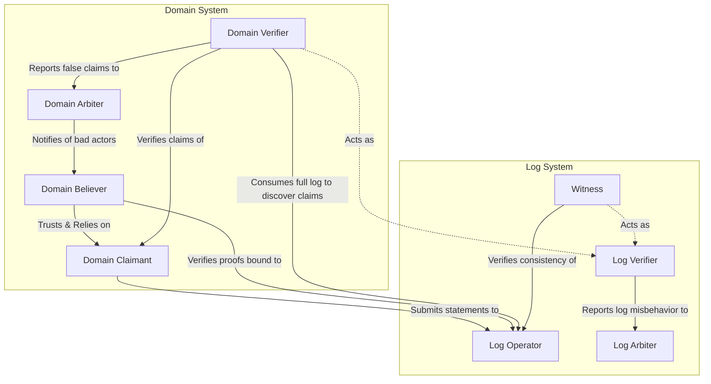

# Claimant Model: Logs

This document applies the Claimant Model to transparent ecosystems built around logs. It requires an understanding of the core [Claimant Model](CoreModel.md).

Log Transparency should be used when you have already established a Claimant Model for your specific domain (e.g., Certificate Transparency) and need a way to ensure that claims are discoverable. It is not for situations where you "just want to write to a log."

## Purpose of Log Transparency

**The main purpose of transparency built around logs is the *discoverability of Claims*.**

A Claim is discoverable if the Verifier can find it without relying on the Believer to pass it to them. This property is essential when Believers use a "Trust But Verify" strategy and cannot guarantee they will report every claim they see.

More formally: *Any claim believed by any honest Believer must be eventually verified by an honest Verifier.*

In other words, Logs provide a verifiable transport mechanism to ensure that any Claim a Believer relies on will eventually be discovered by the Verifier.

# The Model

Log Transparency applies the Claimant Model to solve a transport problem in the **Domain System** (the application layer, like certificates). It ensures that all **Domain Statements** relied upon by a **Domain Believer** can be discovered by the **Domain Verifier**.

## The Log System

In this layer, the Log itself becomes the system we are modeling:

*   **Log Claim**: *"I make available a globally consistent, append-only list of Domain Statements."*
*   **Log Statement**: The Log Checkpoint (signed by the log).
*   **Log Claimant**: The Claim Log (operator).
*   **Log Believer**: Both the **Domain Believer** and the **Domain Verifier**.
*   **Log Verifier**: The Log Verifier (watches for consistency).
*   **Log Arbiter**: The Log Arbiter (handles disputes).

### Key Artifacts

*   **Log Checkpoint (aka STH)**: A signed statement by the **Log Claimant** declaring the number of entries in the log and committing to its contents. The signature does not verify the *veracity* of the domain claims; it only asserts that:
    *   This Checkpoint is consistent with all earlier Checkpoints.
    *   All Domain Statements committed to by this Checkpoint are immutable and discoverable.

### Roles in the Log System

*   **Log Operator (Log Claimant)**: Maintains the log, appends valid Statements, and periodically produces Checkpoints. All Statements must be made available to Domain Verifiers.
*   **Log Verifier**: This role ensures the integrity and availability of the log. It encompasses two primary responsibilities that are often handled by different actors:
    1.  **Consistency Verification**: Ensuring that all Checkpoints represent a single, append-only lineage. In practice, this is often performed by independent **Witnesses** (see [C2SP Witness](http://c2sp.org/tlog-witness) and the [Witness Network](https://witness-network.org/)) who verify checkpoints without necessarily downloading the full log contents.
    2.  **Data Availability**: Confirming that all Domain Statements committed to by the checkpoints are actually available. This is performed by actors who download the full log, or by using auditing tools like Tessera's [fsck](https://github.com/transparency-dev/tessera/tree/main/cmd/fsck).
    
    *Note: Remember that the Log Verifier is a role, not an actor; it is common for multiple distinct actors to share this responsibility to cover both jobs.*
*   **Log Arbiter**: Acts on evidence of log misbehavior (e.g., presenting inconsistent checkpoints or denying service).
*   **Claim Writer**: The party that writes claims to the log. This might be the Domain Claimant, the Domain Believer, or a third party.

### Relationship Graph

This shows which roles must know about each other before the system can operate.

```mermaid
graph TD
    subgraph "Domain System"
        DB[Domain Believer]
        DC[Domain Claimant]
        DV[Domain Verifier]
        DA[Domain Arbiter]
    end

    subgraph "Log System"
        LO[Log Operator]
        LV[Log Verifier]
        LA[Log Arbiter]
        W[Witness]
    end

    %% Relationships
    DB -->|Trusts & Relies on| DC
    DV -->|Verifies claims of| DC
    DV -->|Reports false claims to| DA
    DA -->|Notifies of bad actors| DB

    %% Log interactions
    DC -->|Submits statements to| LO
    DB -->|Verifies proofs bound to| LO
    DV -->|Consumes full log to discover claims| LO
    
    W -->|Verifies consistency of| LO
    LV -->|Reports log misbehavior to| LA
    
    %% Role Overlap
    DV -. Acts as .-> LV
    W -. Acts as .-> LV
```

> [!NOTE]
> **Witness Behavior:** While the diagram shows the Log Verifier role reporting misbehavior to the Arbiter, independent **Witnesses** often operate passively. They verify consistency and sign checkpoints that are correct, but if they encounter an inconsistent checkpoint, they simply refuse to sign it. The absence of a quorum of witness signatures is what signals that the log may be compromised, rather than an active report being filed.

# Appendix

## Transitive Signing

The signature on each individual **Domain Statement** can be omitted if both of the following hold:
1.  The **Domain Claimant** and the **Log Claimant** are the same actor.
2.  Every actor that is a **Domain Believer** is also a **Log Believer**.

In this case, the signature on the Checkpoint transitively signs each of the Claims within the log. This is how the [Go SumDB](https://blog.golang.org/module-mirror-launch) works. The claim is: *"I, SumDB, commit to [Hash] as the checksum for [Module] at [Version]."* This is falsifiable because correctness can be verified by confirming that no two entries have the same module and version but different checksums.

## Practical Deployment & Proof Distribution

While the Claimant Model describes abstract roles, the security and privacy of a real-world system depend heavily on how **Domain Believers** obtain and verify proofs.

There are two primary patterns for distributing inclusion proofs:

### 1. Online Lookup
In this model, the Believer receives a statement and queries the Log Operator directly to fetch a proof of inclusion.
*   **How it works**: The Believer asks the log: "Is this entry included, and what is the current checkpoint?"
*   **Trade-offs**: This is simple to implement but introduces privacy leaks (the log operator learns what the believer is looking up) and requires the log to be highly available to handle lookup traffic from all believers.

### 2. Offline Inclusion Proofs (Bundled)
This is the more modern and prevalent pattern. Instead of the Believer fetching proofs, the **Domain Claimant** (or a submitter) logs the entry, fetches the proof, and bundles it directly with the object being distributed.
*   **How it works**: The Believer is given the data and an offline proof (see the [C2SP tlog-proof spec](https://c2sp.org/tlog-proof)). The Believer verifies the log's signature on the checkpoint (and potentially witness signatures) and checks the Merkle proof locally.
*   **Impact**: This moves transparency towards a **richer signature scheme**. A valid claim is no longer just a cryptographic signature from a key; it is a signature *plus* a verifiable proof that the signature was made public in a consistent log. This eliminates privacy leaks to the log and removes the log from the critical path of verification.
