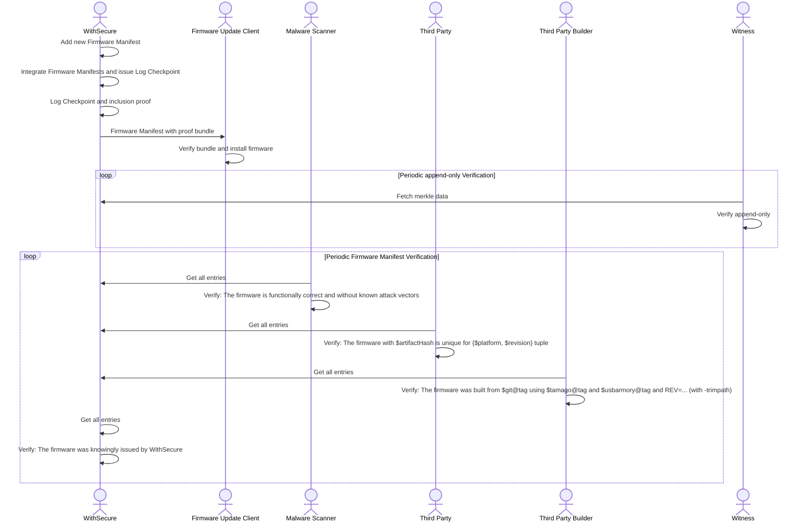

<!--- This content generated with:
go run github.com/google/trillian/docs/claimantmodel/experimental/cmd/render@master --full_model_file ./cmd/render/internal/models/armorydrive/full.yaml
-->

```mermaid
sequenceDiagram
    actor WithSecure
    actor Firmware Update Client
    actor Malware Scanner
    actor Third Party
    actor Third Party Builder
    actor Witness
    WithSecure->>WithSecure: Add new Firmware Manifest
    WithSecure->>WithSecure: Integrate Firmware Manifests and issue Log Checkpoint
    WithSecure->>WithSecure: Log Checkpoint and inclusion proof
    WithSecure->>Firmware Update Client: Firmware Manifest with proof bundle
    Firmware Update Client->>Firmware Update Client: Verify bundle and install firmware
    loop Periodic append-only Verification
        Witness->>WithSecure: Fetch merkle data
        Witness->>Witness: Verify append-only
    end
    loop Periodic Firmware Manifest Verification
        Malware Scanner->>WithSecure: Get all entries
        Malware Scanner->>Malware Scanner: Verify: The firmware is functionally correct and without known attack vectors
        Third Party->>WithSecure: Get all entries
        Third Party->>Third Party: Verify: The firmware with $artifactHash is unique for {$platform, $revision} tuple
        Third Party Builder->>WithSecure: Get all entries
        Third Party Builder->>Third Party Builder: Verify: The firmware was built from $git@tag using $tamago@tag and $usbarmory@tag and REV=... (with -trimpath)
        WithSecure->>WithSecure: Get all entries
        WithSecure->>WithSecure: Verify: The firmware was knowingly issued by WithSecure
    end
```
