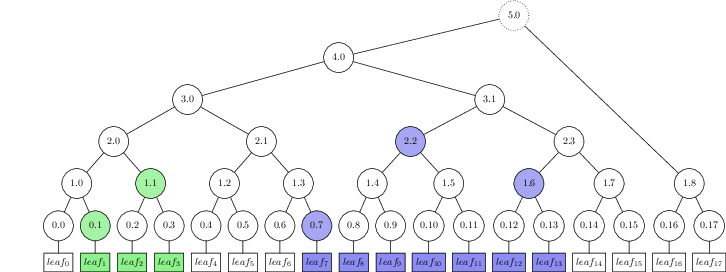

Treetex
=======

`treetex` is a tool for drawing/visualising Merkle trees.

Ensure you have `LaTeX` installed on your system if you want to use this; the
tool outputs `LaTeX` commands to stdout, and so needs to be used in conjuction
with that.

For debian-derived systems, `sudo apt install texlive` should do the trick.


Usage
-----

```bash
go run github.com/google/trillian/docs/merkletree/treetex | pdflatex
```
(if you've not used that much tex - that'll create a file called `texput.pdf`)
You can use `okular` (or your favourite PDF viewer) to view it.

Use `--tree_size` flag to, er, set the tree size.


Features
--------
Treetex has a few tricks up its sleeve:

### Ephemeral nodes

This tool draws trees with all the leaves at the same level as opposed to
floating them up to their real level - mainly because this is how the trees in
[RFC6962](https://tools.ietf.org/html/rfc6962) are drawn.
Nodes which aren't yet final are displayed with no border.

### Large trees
When drawing 'large' tree sizes, set the `--megamode_threshold` flag (default
is 4) to "collapse" perfect subtrees with at least this many levels.

```bash
go run github.com/google/trillian/docs/merkletree/treetex --tree_size=100023 --megamode_threshold=4
```


### Inclusion proofs
Highlight an inclusion proof using the `--inclusion` flag.

```bash
go run github.com/google/trillian/docs/merkletree/treetex --tree_size=23 --inclusion=13
```


### Explicit leaf data
Choose-your-own-~~adventure~~-data.
Use the `--leaf_data` flag to specify comma-separated leaf data text
explicitly.
Takes LaTex commands too.

```bash
go run github.com/google/trillian/docs/merkletree/treetex --leaf_data='entry1,thing too,${\alpha}$,${\frac{bananas_{\beta}}{\delta}}$,{\LaTeX}'
```


### Explain-Merkle-trees mode
To draw diagrams which explain what each node hash is, use the
`--node_format=hash` flag.

```bash
go run github.com/google/trillian/docs/merkletree/treetex --tree_size=7 --node_format=hash
```


### Compact Range proofs
To highlight nodes which make up (multiple) range proofs, use the `--ranges`
flag.

```bash
go run github.com/google/trillian/docs/merkletree/treetex --tree_size=18 --ranges=1:3,7:14
```



