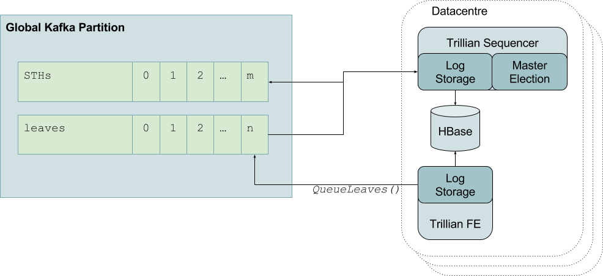

## Commit-Log based Trillian storage

*Status: Draft*

*Authors: al@google.com, drysdale@google.com, filippo@cloudflare.com*

*Last Updated: 2017-05-12*

## Objective

A design for an alternative Trillian storage layer which uses a distributed and
immutable *commit log* as the source of truth for a Trillian Log's contents and
sequence information, and one or more independent *"readonly"* databases built
from the commit log to serve queries.

This design allows for:

*   flexibility in scaling Trillian deployments,
*   easier recovery from corrupt/failed database deployments since in many
    cases operators can simply delete the failed DB instance and allow it to be
    rebuilt from the commit log, while the remaining instances continue to
    serve.

Initially, this will be built using Apache Kafka for the commit log, with
datacentre-local Apache HBase instances for the serving databases, since this
is what Cloudflare has operational experience in running, but other distributed
commit-log and database engines may be available - this model should also work
with instance-local database implementations such as RocksDB etc. too.

Having Trillian support a commit-log based storage system will also ensure
Trillian doesn't inadvertently tie itself exclusively to strong globally
consistent storage.

## Background

Trillian currently supports two storage technologies, MySQL and Spanner, which
provide strong global consistency.

The design presented here requires:

*   A durable, ordered, and immutable commit log.
*   A "local" storage mechanism which can support the operations required by
    the Trillian {tree,log}_storage API.


## Design Overview



The `leaves` topic is the canonical source of truth for the ordering of leaves
in a log.

The `STHs` topic is a list of all STHs for a given log.

Kafka topics are configured never to expire entries (this is a supported mode),
and Kafka is known to scale to multiple terabytes within a single partition.

HBase instances are assumed to be one-per-cluster, built from the contents of
the Kafka topics, and, consequently, are essentially disposable.

Queued leaves are sent by the Trillian frontends to the Kafka `Leaves` topic.
Since Kafka topics are append-only and immutable, this effectively sequences
the entries in the queue.
The signer nodes track the leaves and STHs topics to bring their local database
instances up-to-date.  The current master signer will additionally incorporate
new entries in the leaves topic into its tree, ensuring the Kafka offset number
of each leaf matches its position in the Merkle tree, then generate a new
STH which it publishes to the STH topic before updating its local database.

Since the commit log forms the source of truth for the log entry ordering and
committed STHs, everything else can be derived from that. This means that
updates to the serving HBase DBs can be made to be idempotent, which means that
the transactional requirements of Trillian's LogStorage APIs can be relaxed:
writes to local storage can be buffered and flushed at `Commit` time, and the
only constraint on the implementation is that the final new/updated STH must
only be written to the local storage iff all other buffered writes have been
successfully flushed.

The addition of this style of storage implementation requires that Trillian
does not guarantee the perfect deduplication of entries, even though it may be
possible to do so with some storage implementations.  i.e. personalities MUST
present LeafIdentityHashes, and Trillian MAY deduplicate.

## Detailed Design

#### Enqueuing leaves

RPC calls to frontend `QueueLeaves` results in the leaves being individually
added to the Kafka topic `Leaves`.  They need to be added individually to allow
the Kafka topic sequencing to be the definitive source of log sequence
information.

Log frontends may attempt to de-duplicate incoming leaves by consulting the
local storage DB using the identity hash (and/or e.g. using a per-instance LRU
cache), but this will always be a "best effort" affair, so the Trillian APIs
must not assume that duplicates are impossible, even though in practice, when
using other storage implementations, they may well be so currently.

#### Master election

Multiple sequencers may be running to provide resilience, if this is the case
there must be a mechanism for choosing a single master instance among the
running sequencers. The Trillian repo provides an etcd-backed implementation
of this already.

A sequencer must only participate/remain the master if its local database state
is at least as new at the latest message in the Kafka `STHs` topic.

The current master sequencer will create new STHs and publish them to the
`STHs` topic, the remaining sequencers will run in a "mirror" mode to keep
their local database state up-to-date with the master.

#### Local DB storage

This does not *need* to be transactional, because writes should be idempotent,
but the implementation of the Trillian storage driver must buffer *all*
writes and only attempt to apply them to the local storage when `Commit` is
called.

The write of an updated STH to local storage needs slightly special attention,
in that it must be the last thing written by `Commit`, and must only be written
if all other buffered writes succeeded.

In the case of a partial commit failure, or crash of the signer, the next
sequencing cycle should find that identical writes are re-attempted due to the
signer process outlined below.

#### Sequencing

Assigning sequence numbers to queued leaves is implicitly performed by the
addition of entries to the Kafka `Leaves` topic (this is termed *offset* in
Kafka documentation).


##### Abstract Signer process

```golang
func SignerRun() {
  // if any of the below operations fail, just bail and retry

  // read `dbSTH` (containing `treeRevision` and `sthOffset`) from local DB
  dbSTH.treeRevision, dbSTH.sthOffset = tx.LatestSTH()

  // Sanity check that the STH table has what we already know.
  ourSTH := kafka.Read("STHs/<treeID>", dbSTH.sthOffset)
  if ourSTH == nil {
    klog.Errorf("should not happen - local DB has data ahead of STHs topic")
    return
  }
  if ourSTH.expectedOffset != dbSTH.sthOffset {
    klog.Errorf("should not happen - local DB committed to invalid STH from topic")
    return
  }
  if ourSTH.timestamp != dbSTH.timestamp || ourSTH.tree_size != dbSTH.tree_size {
    klog.Errorf("should not happen - local DB has different data than STHs topic")
    return
  }

  // Look to see if anyone else has already stored data just ahead of our STH.
  nextOffset := dbSTH.sthOffset
  nextSTH := nil
  for {
    nextOffset++
    nextSTH = kafka.Read("STHs/<treeID>", nextOffset)
    if nextSTH == nil {
      break
    }
    if nextSTH.expectedOffset != nextOffset {
      // Someone's been writing STHs when they weren't supposed to be, skip
      // this one until we find another which is in-sync.
      klog.Warning("skipping unexpected STH")
      continue
    }
    if nextSTH.timestamp < ourSTH.timestamp || nextSTH.tree_size < ourSTH.tree_size {
      klog.Fatal("should not happen - earlier STH with later offset")
      return
    }
  }

  if nextSTH == nil {
    // We're up-to-date with the STHs topic (as of a moment ago) ...
    if !IsMaster() {
      // ... but we're not allowed to create fresh STHs.
      return
    }
    // ... and we're the master. Move the STHs topic along to encompass any unincorporated leaves.
    offset := dbSTH.tree_size
    batch := kafka.Read("Leaves", offset, batchSize)
    for b := range batch {
      db.Put("/<treeID>/leaves/<b.offset>", b.contents)
    }

    root := UpdateMerkleTreeAndBufferNodes(batch, treeRevision+1)
    newSTH := STH{root, ...}
    newSTH.treeRevision = dbSTH.treeRevision + 1
    newSTH.expectedOffset = nextOffset
    actualOffset := kafka.Append("STHs/<treeID>", newSTH)
    if actualOffset != nextOffset {
      klog.Warning("someone else wrote an STH while we were master")
      tx.Abort()
      return
    }
    newSTH.sthOffset = actualOffset
    tx.BufferNewSTHForDB(newSTH)
    tx.Commit() // flush writes
  } else {
    // There is an STH one ahead of us that we're not caught up with yet.
    // Read the leaves between what we have in our DB, and that STH...
    leafRange := InclusiveExclusive(dbSTH.tree_size, nextSTH.tree_size)
    batch := kafka.Read("Leaves", leafRange)
    // ... and store them in our local DB
    for b := range batch {
      db.Put("<treeID>/leaves/<b.offset>", b.contents)
    }
    newRoot := tx.UpdateMerkleTreeAndBufferNodes(batch, treeRevision+1)
    if newRoot != nextSTH.root {
      klog.Warning("calculated root hash != expected root hash, corrupt DB?")
      tx.Abort()
      return
    }
    tx.BufferNewSTHForDB(nextSTH)
    tx.Commit() // flush writes
    // We may still not be caught up, but that's for the next time around.
  }
}
```

##### Fit with storage interfaces

LogStorage interfaces will need to be tweaked slightly, in particular:
 - `UpdateSequencedLeaves` should be pulled out of `LeafDequeuer` and moved
   into a `LeafSequencer` (or something) interface.
 - It would be nice to introduce a roll-up interface which describes the
   responsibilities of the "local DB" thing, so that we can compose
   `commit-queue+local` storage implementations using existing DB impls
   (or at least not tie this tightly to HBase).

###### TX
```golang

type splitTX struct {
   treeID       int64
   ...

   dbTX         *storage.LogTX // something something handwavy
   cqTX         *storage.???   // something something handwavy

   dbSTH        *trillian.SignedTreeHead
   nextSTH      *trillian.SignedTreeHead  // actually something which contains this plus some metadata
   treeRevision int64
   sthOffset    int64
}
```

###### `Storage.Begin()`

Starts a Trillian transaction, this will do:
   1. the read of `currentSTH`, `treeRevision`, and `sthOffset` from the DB
   1. verification of that against its corresponding entry in Kafka

and return a `LogTX` struct containing these values as unexported fields.
**The HBase LogTX struct will buffer all writes locally until `Commit` is
called**, whereupon it'll attempt to action the writes as HBase `PUT` requests
(presumably it can be smart about batching where appropriate).

```golang
// Begin starts a Trillian transaction.
// This will get the latest known STH from the "local" DB, and verify
// that the corresponding STH in Kafka matches.
func (ls *CQComboStorage) Begin() (LogTX, error) {
  // create db and cq "TX" objects

  tx := &splitTX{...}

  // read `dbSTH` (containing `treeRevision` and `sthOffset`) from local DB
  tx.dbSTH, tx.treeRevision, tx.stdOffset := dbTX.latestSTH()

  // Sanity check that the STH table has what we already know.
  ourSTH := cqTX.GetSTHAt(tx.sthOffset)

  if ourSTH == nil {
    return nil, fmt.Errorf("should not happen - local DB has data ahead of STHs topic")
  }
  if ourSTH.expectedOffset != dbSTH.sthOffset {
    return nil, fmt.Errorf("should not happen - local DB committed to invalid STH from topic")
  }
  if ourSTH.timestamp != dbSTH.timestamp || ourSTH.tree_size != dbSTH.tree_size {
    return nil, fmt.Errorf("should not happen - local DB has different data than STHs topic")
  }

  ...

  return tx, nil
}
```


###### `DequeueLeaves()`
Calls to this method ignore `limit` and `cutoff` when there exist newer STHs in
the Kafka queue (because we're following someone else's footsteps), and return
the `batch` of leaves outlined above.

*TODO(al): should this API be reworked?*

```golang
func (tx *splitTX) DequeueLeaves() (..., error) {
  // Look to see if anyone else has already stored data just ahead of our STH.
  nextOffset := tx.sthOffset
  nextSTH := nil
  for {
      nextOffset++
      tx.nextSTH = tx.cqTX.GetSTHAt(nextOffset)
      if nextSTH == nil {
        break
      }
      if nextSTH.expectedOffset != nextOffset {
        // Someone's been writing STHs when they weren't supposed to be, skip
        // this one until we find another which is in-sync.
        klog.Warning("skipping invalid STH")
        continue
      }
      if nextSTH.timestamp < ourSTH.timestamp || nextSTH.tree_size < ourSTH.tree_size {
        return nil, fmt.Errorf("should not happen - earlier STH with later offset")
    }
  }

  if nextSTH == nil {
    offset := tx.dbSTH.tree_size
    batch := tx.cqTX.ReadLeaves(offset, limit)
    return batch, nil
  } else {
    // There is an STH one ahead of us that we're not caught up with yet.
    for {
      nextOffset++
      nextSTH = tx.cqTX.ReadSTH(nextOffset)
      if nextSTH.timestamp < dbSTH.timestamp || nextSTH.tree_size < dbSTH.tree_size {
        return nil, fmt.Errorf("should not happen - earlier STH with later offset")
      }
    }
    // Read the leaves between what we have in our DB, and that STH...
    leafRange := InclusiveExclusive(dbSTH.tree_size, nextSTH.tree_size)
    batch := tx.cqTX.ReadLeaves(leafRange)
    return nil, batch
  }
}

```

###### `UpdateSequencedLeaves()`

This method should be moved out from `LeafDequeuer` and into a new interface
`LeafWriter` implemented by dbTX.

**TODO(al): keep writing!**


