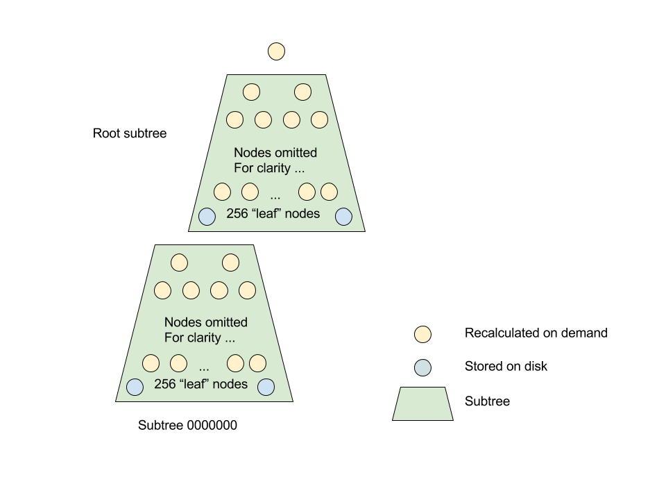
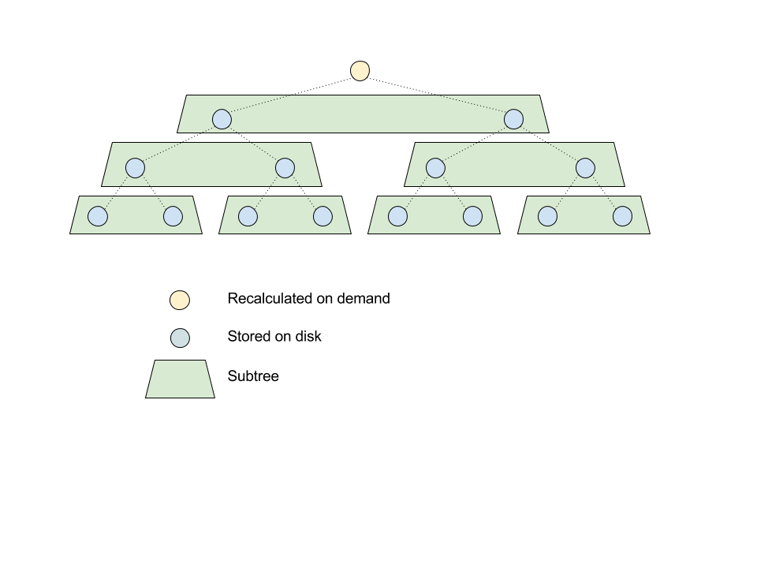
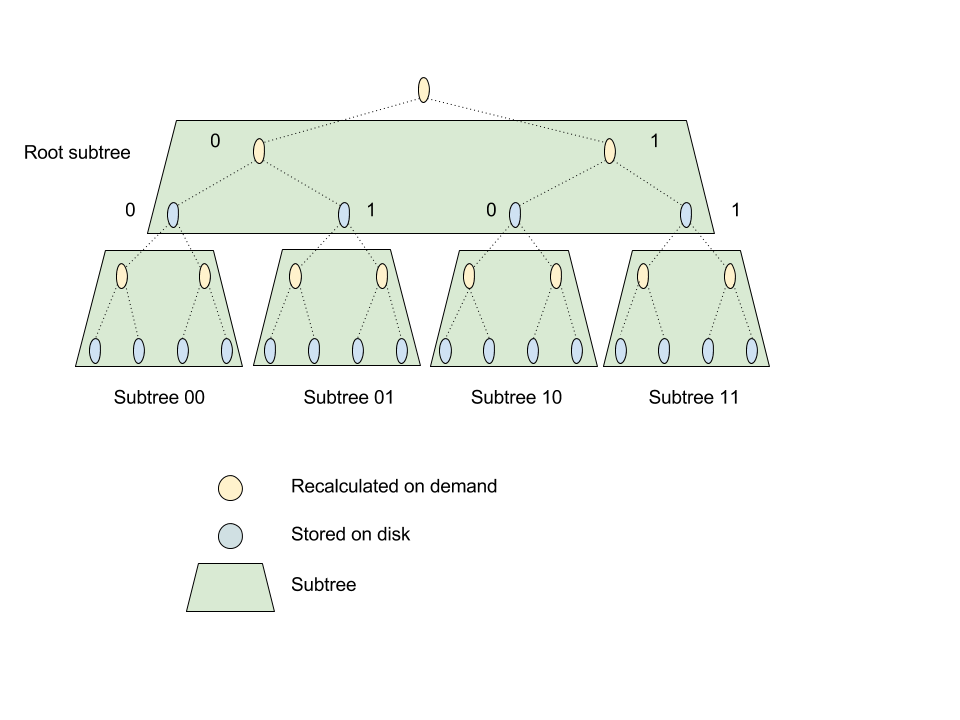
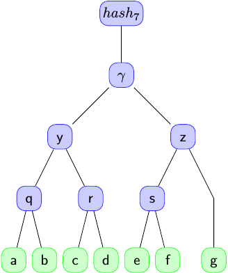
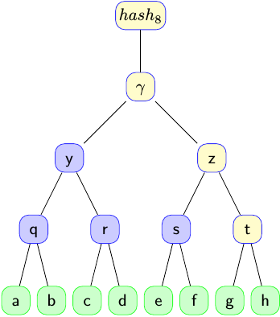

# Storage Design Notes
## Author: Martin Smith

## Tree Node Storage

The node level of storage provides a fairly abstract tree model that is used to implement
verifiable logs and maps. Most users will not need this level but it is important to know the
concepts involved. The API for this is defined in `storage/tree_storage.go`. Related protos are in
the `storage/storagepb` package.

The model provides a versioned view of the tree. Each transaction that modifies the tree results
in a new revision. Revision numbers increase monotonically as the tree is mutated.

### NodeIDs

Nodes in storage are uniquely identified by a `NodeID`. This combines a tree path with
a revision number. The path is effectively used as a bitwise subtree prefix in the tree.
In our subtree storage optimization the path prefix identifies the subtree and the remaining
path is the path to the node within that subtree.

The same `NodeID` objects are used by both logs and maps but they are interpreted differently.
There are API functions that create them for each case. Mixing node ID types in API calls will
give incorrect results.

### Subtree Stratification

As an optimization, the tree is not stored as a set of raw nodes but at as a collection of subtrees.

Currently, subtrees must be be a multiple of 8 levels deep (referred to as `strataDepth` in the
code) so it's not allowed to have e.g. a 7 level depth but 8 or 16 is fine. Only the bottom level
nodes (the "leaves") of each subtree are physically stored. Intermediate subtree nodes are rehashed
from the "leaves" when the subtree is loaded into memory. See `storage/cache/subtree_cache.go` for
more details.

Note some caveats to the above paragraph. If depth multiples other than 8 are used this
might require changes to the way node ID prefix and suffixes are packed and unpacked from
byte slices. There are additional assumptions that all log subtrees are the same depth, though
these would be easier to remove.

For maps the internal nodes are always cleared when stored and then rebuilt from the subtree
"leaf" nodes when the subtree is reloaded. Logs use a modified strategy because it is possible
for internal nodes to depend on more than one subtree. For logs the internal nodes are cleared
on storage if the subtree is fully populated. This prevents the loss of internal nodes that
depend on other subtrees as the tree is growing in levels.

This storage arrangement was chosen because we have predictable access patterns to our data and do
not require classes of tree modification like re-parenting a subtree. It would probably not be
suitable for a general purpose tree.

Subtrees are keyed by the `NodeID` of the root (effectively a path prefix) and contain the
intermediate nodes for that subtree, identified by their suffix. These are actually stored in a
proto map where the key is the suffix path.

Subtrees are versioned to support the access model for nodes described above. Node addresses within
the model are distinct because the path to a subtree must be unique.

When node updates are applied they will affect one or more subtrees and caching is used to increase
efficiency. After all updates have been done in-memory the cache is flushed to storage so each
affected subtree is only written once. All writes for a transaction will be at the same revision
number.

Subtrees are helpful for reads because it is likely that many of the nodes traversed in
Merkle paths for proofs are part of the same subtree. The number of subtrees involved in a path
through a large tree from the leaves to the root is also bounded. For writes the subtree update
batches what would be many smaller writes into one larger but manageable one.

We gain space efficiency by not storing intermediate nodes (except as noted above for logs
and partially full subtrees). This is a big saving, especially for log storage. It avoids storing
entire tree levels, which get very large as the tree grows. This adds up to an approx 50% space
saving. This is magnified further as we store many versions of the tree. For the map case
things aren't quite as good because multiple subtree revisions need to be stored with the same
prefix but only one "leaf" node differing. The efficiency of this needs to be determined for
large maps.

#### Subtree Diagrams

This diagram shows a tree as it might actually be stored by our code using subtrees of depth 8.

Each subtree does not include its "root" node, though this counts as part of the depth. There are
additional subtrees below and to the right of the child subtree shown, they can't easily be shown
in the diagram. Obviously, there could be less than 256 "leaf" nodes in the subtrees if they are not
yet fully populated. A node always belongs to exactly one subtree, there is no overlap.

As it's hard to visualize the structure at scale with stratum depth 8, some examples of smaller
depths might make things clearer. Though these are not supported by the current implementation
the diagrams are much simpler.

This diagram shows a tree with stratum depth 2. It is a somewhat special case as all the levels are
stored. Note that the root node is never stored and is always recalculated.

This diagram shows a tree with stratum depth 3. Note that only the bottom level of each subtree is
stored and how the binary path is used as a subtree prefix to identify subtrees.

### Consistency and Other Requirements

Storage implementations must provide strongly consistent updates to the tree data. Some users may
see an earlier view than others if updates have not been fully propagated yet but they must not see
partial updates or inconsistent views.

It is not a requirement that the underlying storage is relational. Our initial implementation uses
an RDBMS and has this [database schema diagram](database-diagram.pdf).

## Log Storage

### The Log Tree

The node tree built for a log is a representation of a Merkle Tree, which starts out empty and grows
as leaves are added. A Merkle Tree of a specific size is a fixed and well-defined shape.

Leaves are never removed and a completely populated left subtree of the tree structure is never
further mutated.

The personality layer is responsible for deciding whether to accept duplicate leaves as it controls
the leaf identity hash value. For example it could add a timestamp to the data it hashes so
that duplicate leaf data always has a different leaf identity hash.

The log stores two hashes per leaf, a raw SHA256 hash of the leaf data used for deduplication
(by the personality layer) and the Merkle Leaf Hash of the data, which becomes part of the tree.

### Log NodeIDs / Tree Coordinates

Log nodes are notionally addressed using a three dimensional coordinate tuple (level in tree, index
in level, revision number).

Level zero is always the leaf level and additional intermediate levels are added above this as the
tree grows. Such growth does not affect nodes written at a previous revision. Levels are only
created when they are required. The level of a node is always the level in the overall tree. The
`NodeID` coordinates are independent of any subtree storage optimization.

Index is the horizontal position of the node in the level, with zero being the leftmost node in
each level.

For example in a tree of size two the leaves are (level 0, index 0) and (level 0, index 1) and the
root is (level 1, index 0).

The storage implementation must be able to provide access to nodes using this coordinate scheme but
it is not required to store them this way. The current implementation compacts subtrees for
increased write efficiency so nodes are not distinct database entities. This is hidden by the node
API.

### Log Startup

When log storage is intialized and its tree is not empty the existing state is loaded into a
`compact_merkle_tree`. This can be done efficiently and only requires a few node accesses to
restore the tree state by reading intermediate hashes at each tree level.

As a crosscheck the root hash of the compact tree is compared against the current log root. If it
does not match then the log is corrupt and cannot be used.

### Writing Leaves and Sequencing

In the current RDBMS storage implementation log clients queue new leaves to the log, and a
`LeafData` record is created. Further writes to the Merkle Tree are coordinated by the sequencer,
which adds leaves to the tree. The sequencer is responsible for ordering the leaves and creating
the `SequencedLeafData` row linking the leaf and its sequence number. Queued submissions that have
not been sequenced are not accessible via the log APIs.

When leaves are added to the tree they are processed by a `merkle/compact_merkle_tree`, this causes a
batched set of tree node updates to be applied. Each update is given its own revision number. The
result is that a number of tree snapshots are directly available in storage. This contrasts with
[previous implementations](https://github.com/google/certificate-transparency/blob/master/cpp/merkletree/)
for Certificate Transparency where the tree is in RAM and only the most recent snapshot is directly
available. Note that we may batch log updates so we don't necessarily have all intermediate tree
snapshots directly available from storage.

As an optimization intermediate nodes with only a left child are not stored. There is more detail
on how this affects access to tree paths in the file `merkle/merkle_paths.go`. This differs from
the
[Certificate Transparency C++](https://github.com/google/certificate-transparency/blob/master/cpp/merkletree/merkle_tree.h)
in-memory tree implementation. In summary the code must handle cases where there is no right
sibling of the rightmost node in a level.

Each batched write also produces an internal tree head, linking that write to the revision number.

### Reading Log Nodes

When nodes are accessed the typical pattern is to request the newest version of a node with a
specified level and index that is not greater than a revision number that represents the tree at a
specific size of interest.

If there are multiple tree snapshots at the same tree size it does not matter which one is picked
for this as they include the same set of leaves. The Log API provides support for determining the
correct version to request when reading nodes.

#### Reading Leaves

API requests for leaf data involve a straightforward query by leaf data hash, leaf Merkle hash or
leaf index followed by formatting and marshaling the data to be returned to the client.

#### Serving Proofs

API requests for proofs involve more work but both inclusion and consistency proofs follow the
same pattern.

Path calculations in the tree need to be based on a particular tree revision. It is possible to
use any tree revision that corresponds to a tree at least as large as the tree that the proof is
for. We currently use the most recent tree revision number for all proof node calculation /
fetches. This is useful as we already have it available from when the transaction was initialized.

There is no guarantee that we have the exact tree size snapshot available for any particular
request so we're already prepared to pay the cost of some hash recomputation, as described further
below. In practice the impact of this should be minor, and will be amortized across all requests.
The proof path is also limited to the portion of the tree that existed at the time of the
requested tree, not the version we use to compute it.

An example may help here. Suppose we want an inclusion proof for index 10 from the tree as it was
at size 50. We use the latest tree revision, which corresponds to a size of 250,000,000. The
path calculation cannot reference or recompute an internal node that did not exist at tree
size 50 so the huge current tree size is irrelevant to serving this proof.

The tree path for the proof is calculated for a tree size using an algorithm based on the
reference implementation of RFC 6962. The output of this is an ordered slice of `NodeIDs` that must
be fetched from storage and a set of flags indicating required hash recomputations. After a
successful read the hashes are extracted from the nodes, rehashed if necessary and returned to
the client.

Recomputation is needed because we don't necessarily store snapshots on disk for every tree size.
To serve proofs at a version intermediate between two stored versions it can be necessary to
recompute hashes on the rightmost path. This requires extra nodes to be fetched but is bounded
by the depth of the tree so this never becomes unmanageable.

Consider the state of the tree as it grows from size 7 to size 8 as shown in the following
diagrams:

Assume that only the size 8 tree is stored. When the tree of size eight is queried for an
inclusion proof of leaf 'e' to the older root at size 7 the proof cannot be directly constructed
from the node hashes as they are represented in storage at the later point.

The value of node 'z' differs from the prior state, which got overwritten when the internal node ‘t’
was added at size 8. This hash value 'z' at size 7 is needed to construct the proof so it must
be recalculated. The value of 's' is unchanged so hashing 's' together with 'g' correctly
recreates the hash of the internal node 'z'.

The example is a simple case but there may be several levels of nodes affected depending on the
size of the tree and therefore the shape of the right hand path at that size.

