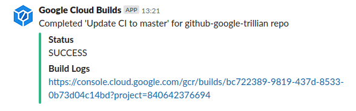
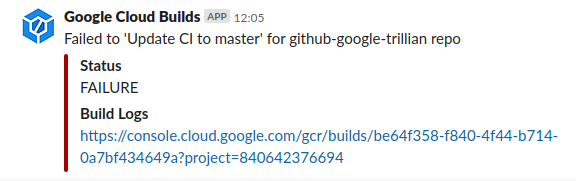

# Slack Notifications for Google Cloud Build

> This is not an officially supported Google product.

This Google Cloud Function sends a notification to a Slack channel whenever a
Google Cloud Build completes.




## Installation

### Create a Slack Webhook

Follow
[Slack's "Getting Started with Incoming Webhooks" instructions](https://api.slack.com/messaging/webhooks)
to create a Slack app and incoming webhook URL. This URL will be required in the
next installation step.

### Deploy Google Cloud Function

If you don't already have a Google Cloud project, [create one now](https://cloud.google.com/resource-manager/docs/creating-managing-projects). Ensure that you have the [Google Cloud SDK](https://cloud.google.com/sdk/) installed as well.

Run the following command to deploy this Google Cloud Function, after changing
`$PROJECT` to your
[Google Cloud project ID](https://cloud.google.com/resource-manager/docs/creating-managing-projects#identifying_projects)
and `$SLACK_WEBHOOK_URL` to the webhook URL you created in the previous
installation step. You may also customise `$FUNC_NAME` and `$STAGE_BUCKET`.

```shell
# Required parameters
$ PROJECT="YOUR-GOOGLE-CLOUD-PROJECT-ID"
$ SLACK_WEBHOOK_URL="YOUR-SLACK-WEBHOOK-URL"
# Customisable parameters
$ FUNC_NAME="cloudbuild2slack"
$ STAGE_BUCKET="${PROJECT}-cloudbuild2slack"

$ gcloud --project="${PROJECT}" functions deploy "${FUNC_NAME}" \
    --stage-bucket="${STAGE_BUCKET}" \
    --trigger-topic="cloud-builds" \
    --runtime="nodejs10" \
    --set-env-vars="SLACK_WEBHOOK_URL=${SLACK_WEBHOOK_URL}"
```
